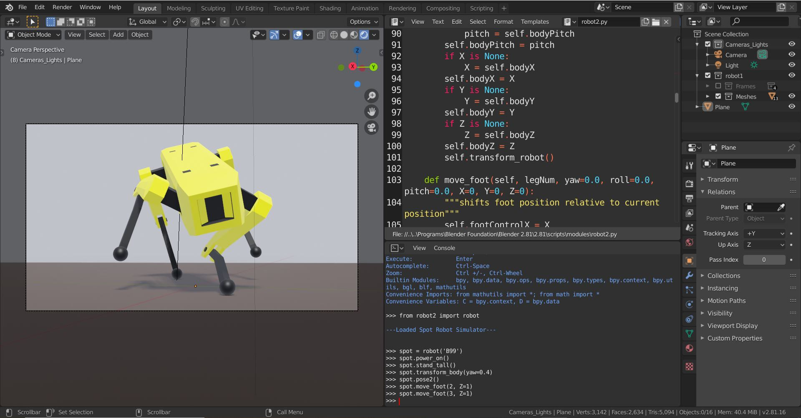

# spot-blender
 Use Blender and Python to "simulate" interactions with the Boston Dynamics quadruped robot, Spot.


## Setup
1. You will need to download and install the latest version of Blender 2.8 from [blender.org](blender.org).
2. Download/clone this repository.
3. If you are new to Blender, it can have a steep learning curve so watching an introductory tutorial for Blender 2.8 would be smart. I always recommend Blender Guru.
4. Add the python script to the modules folder of your Blender installation.
5. After you have learned some of the basics to Blender, run Blender and open the .blend file in this repo.



## In Blender
* Create two areas similar to the blender screenshot above and change their types to the Text Editor and the Python Console. This link might help the new blender users, [Blender Areas](https://docs.blender.org/manual/en/latest/interface/window_system/areas.html).
* Via the python console, import the python script as whatever you like, create an instance of the class, and begin giving commands to Spot.
* Use the script itself in the Text Editor to learn what you can do with each function. The next section details some of the possible options.

## Python User Functions
```python
create_robot(self)

power_on(self)

crouch(self)

stand_tall(self)

pose1(self)

pose2(self)

power_off(self)

transform_body(self, yaw=None, roll=None, pitch=None, X=None, Y=None, Z=None)

move_foot(self, legNum, yaw=0.0, roll=0.0, pitch=0.0, X=0, Y=0, Z=0)
"""shifts foot position relative to current position"""

move(self, yaw=0.0, roll=0.0, pitch=0.0, X=0, Y=0, Z=0):
"""moves footprint frame"""
```

## How it Works
The python script uses basic robotics mathematics and python to manipulate the blender empties into various positions and orientations in the 3D Viewport. The mesh was modeled and then parented to each empty using Blender.

This "simulation" was created in a couple of days so you will notice the documentation and mesh are fairly low quality. Please email me if you have any further questions.
